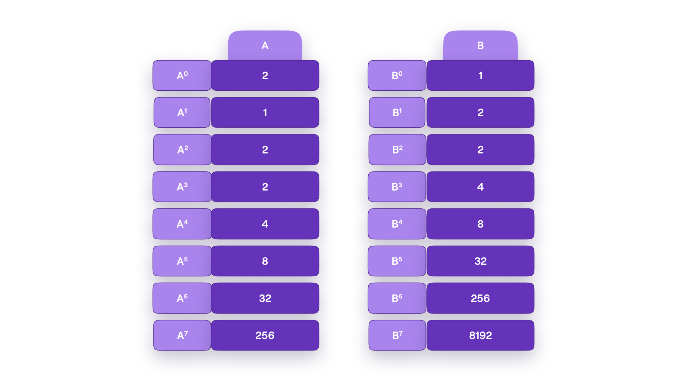
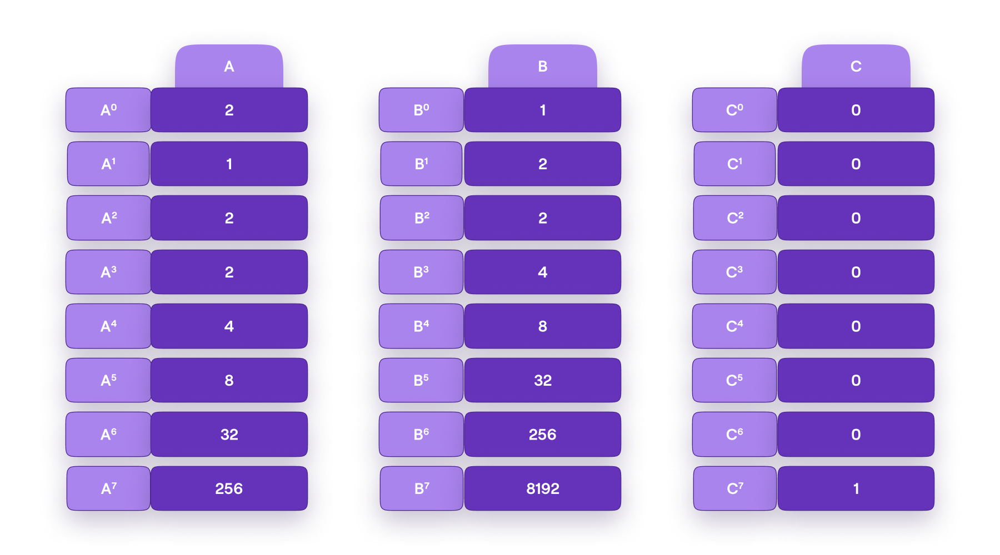
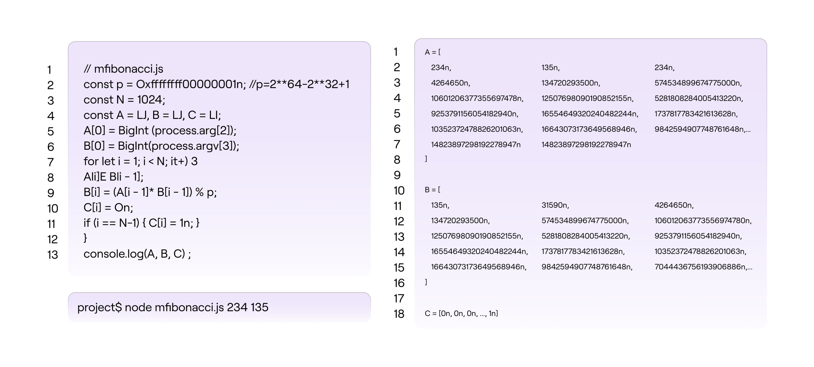

Consider a proof/verification scheme, using an arbitrary Polynomial Commitment Scheme, where users have to prove knowledge of the N-th member of a multiplicative Fibonacci Series, for specific initial conditions.

## What is a multiplicative Fibonacci series?

The multiplicative Fibonacci Series (or simply mFibonacci Series), denoted by
$$
\mathbf{a_0, a_1, a_2, \dots , a_n}
$$

has the property that the product of every two consecutive members $\mathbf{a_{i-1}}$ and $\mathbf{a_i}$ gives the value of the next member $\mathbf{a_{i+1}}$. That is, $\mathbf{ a_{i+1} = a_{i-1}\cdot a_i }$.

Also, the initial values are specified as $\mathbf{a_0} = 2$ and $\mathbf{a_1} = 1$.

Here are the first ten members of the mFibonacci Series,

$$
\mathbf{ \ \ 2,\ \ 1,\ \ 2,\ \ 2,\ \ 4,\ \ 8,\ \ 32,\ \ 256,\ \ 8192,\ \ 2097152,\ \ \dots }
$$

As a trivial example, the challenge may be: Prove knowledge of the initial values that produced $\mathbf{a_{10} = 17179869184}$, the eleventh member of the mFibonacci Series, without revealing the initial values.

The task therefore, is to first build a state machine that would enable anyone to prove knowledge of the initial values $\mathbf{a_0}$ and $\mathbf{a_1}$ that yields a specific N-th member of the mFibonacci Series.

## Constructing mFibonacci state machine

Consider a state machine with two registries $\mathbf{A}$ and $\mathbf{B}$ where
$$
\begin{aligned}
\mathbf{A} = [A_0, A_1, \dots , A_T ], \\
\mathbf{B} = [B_0, B_ 1, \dots , B_T]
\end{aligned}
$$
such that the i-th state is the pair $\big( A_i , B_i \big)$.

Such a state machine is an **mFibonacci state machine** if indeed the registry values conform to the format of the mFibonnacci Series. See Figure 4 below, for an mFibonacci state machine with the initial conditions, $A_0 = 2$ and $B_0 = 1$.

The state transitions from $\mathtt{S} = \big( A_i , B_i \big)$ to $\mathtt{S}' = \big( A_{i+1} , B_{i+1} \big)$ conform to the following constraints;

$$
\begin{aligned}
{ A_{i+1} = B_i \quad\text{ }\text{ }\text{ }  } \\
{ B_{i+1} = A_i \cdot B_i }
\end{aligned}
$$

The aim here is to; express the evolution of the execution trace in terms of polynomials, build corresponding polynomial identities, and ultimately construct a ZK proof/verification scheme for our mFibonacci state machine.

## Building polynomial identities

The polynomials that represent the two registries are taken from the set of polynomials $\mathbb{F}_p [X]$, where the coefficients are elements of a prime field $\mathbb{F}_p$ and $p = 2^{64} − 2^{32} + 1$.

The polynomials are evaluated over the subgroup
$$
{\mathcal{H}} = \{ \omega, \omega^2, \omega^3, \dots , \omega^7, \omega^8 = 1 = \omega^0 \} = \langle \omega \rangle \subseteq \mathbb{F}_p^*
$$
of order $8$.

Define two polynomials $P(X)$ and $Q(X)$ such that:

$$
\begin{aligned}
P(\omega^i) = A[i] \ \ \iff  \ \ A = [2,1,2,2,4,8,32,256]\quad\text{ }\text{ } \\
Q(\omega^i) = B[i]  \ \ \iff \ \  B = [1,2,2,4,8,32,256,8192]
\end{aligned}
$$

Since every $X$ in ${\mathcal{H}}$ is of the form $X = \omega^i$ for some $i$, we have

$$
\begin{aligned}
P(X\cdot \omega) &=  P(\omega^{i + 1})  =  A_{i+1}, \\
Q(X\cdot \omega) &= Q(\omega^{i+1})  =  B_{i+1}.
\end{aligned}
$$

The previously stated constraints, imposed on the state transitions $\mathtt{S} \to \mathtt{S}'$ of the mFibonacci state machine, translate into the following polynomial identities;

$$
P(X\cdot \omega) = \bigg\lvert_{\mathcal{H}}\  Q(X),\qquad\text{ } \\
Q(X\cdot \omega) = \bigg\lvert_{\mathcal{H}}\  P(X) \cdot Q(X)
$$

If these polynomial identities should accurately express the two registries, then every state transition of the mFibonacci SM must satisfy them.

## Non-cyclicity of mFibonacci SM

Note that the definition of ${\mathcal{H}}$ does not restrict the values of $i$ to be less than $8$.

Even if we set $i = 27$, the element  $\omega^{27}$  is in ${\mathcal{H}}$ because

$$
\begin{aligned}
\omega^{27} = w^8 \cdot \omega^8 \cdot \omega^8 \cdot \omega^3 = 1 \cdot 1 \cdot 1 \cdot \omega^3 = \omega^3
\end{aligned}
$$

However, the unrestricted value of $i$, which implies there is no bound on the number of state changes (i.e., on the clock), presents problems with the above polynomial identities.

Let us test if the polynomial identities hold true for all permissible values of $i$. So let $X = \omega^7$ and refer to the registry values given in Figure 4.

- For the first identity we get,

$$
\begin{aligned}
P(X\cdot \omega) = P(\omega^7 \cdot \omega) = P(\omega^8) = P(\omega^0) = A_0 = 2\ \ \\
\text{ but }\ Q(X) = Q(\omega^7) = 8192 \not= 2 \quad\qquad\qquad\qquad\quad
\end{aligned}
$$

- Similarly, for the second identity, we get,

$$
\begin{aligned}
Q(X\cdot \omega) = Q(\omega^7 \cdot \omega) = Q(\omega^8) = Q(\omega^0) = B_0 = 1\ \ \text{ but } \qquad \\
P(X)\cdot Q(X) = P(\omega^7)\cdot Q(\omega^7) = 256\cdot 8192 = 2097152 \not= 1 \quad
\end{aligned}
$$

Clearly, the polynomial identities are not aligned with the registry values of the mFibonacci SM. The reason for this disparity is that, whereas $H$ is cyclic, the polynomial identities are not.

## Introducing cyclicity

In order to inject some cyclicity into the mFibonacci SM, we add a third registry $\mathbf{C} = [C_1, C_2, \dots , C_T]$ and set the registry values to $\mathbf{C} = [0, 0, \dots , 0, 1]$.

Hence the mFibonacci SM is as depicted in Figure 5 below.

The corresponding polynomial $R(x)$ is defined as follows;
$$
R(\omega^i) = C[i]
$$

That is;

$$
\begin{aligned}
R(\omega^i) &= C[i] = 1, \text{ if } \ \ (i+1)\mod 8 = 0 \\
R(\omega^i) &= C[i] = 0, \text{ otherwise}
\end{aligned}
$$

The polynomial $R(x)$ is incorporated into the previous polynomial identities as follows;

$$
\begin{aligned}
P(X \cdot \omega) = \bigg\lvert_{\mathcal{H}}\ \
 Q(X) \cdot \big( 1 − R(X) \big) + R(X)\cdot  A_0
\quad\quad\text{ }\text{ }\text{ } \\
Q(X\cdot \omega) = \bigg\lvert_{\mathcal{H}}\ \
(1 − R(X)) \cdot P(X)\cdot Q(X) + R(X)\cdot B_0
\end{aligned}
$$

Note that, for all the states where the new registry $C[i] = 0$, these new identities coincide with the previous ones (where only registries $A$ and $B$ were used).

These polynomial identities can be rewritten as;

$$
\begin{aligned}
\big( 1 − R(X) \big) \cdot \big[ P(X\cdot \omega) − Q(X) \big] + R(X)\cdot \big[ P(X \cdot \omega) − A_0 \big] = \bigg\lvert_{\mathcal{H}}\ 0\quad\text{ }\text{ }\text{ } \\
(1 − R(X)) · [Q(Xω) − (P(X) · Q(X))] + R(X)\cdot [Q(Xω) − B_0] = \bigg\lvert_{\mathcal{H}}\ 0
\end{aligned}
$$

Let's check if these identities are cyclic. Again, let $X = \omega^7$ and use the registry values given in the figure.

- For the first identity, we observe that,

$$
\begin{aligned}
\text{LHS} &= P(X\cdot \omega) = P(\omega^7 \cdot \omega) = P(\omega^8) = P(\omega^0) = A_0 = 2\ \ \text{ and } \\
\text{RHS} &=  Q(X)\cdot \big( 1 − R(X) \big) + R(X)\cdot A_0\
=\ Q(\omega^7)\cdot \big( 1 − 1 \big) + 1\cdot 2 = 2 = \text{LHS}
\end{aligned}
$$

- Similarly, for the second identity, we observe that,

$$
\begin{aligned}
\text{LHS} &= Q(X\cdot \omega) = Q(\omega^7 \cdot \omega) = Q(\omega^8) = Q(\omega^0) = B_0 = 1 \ \ \text{ and } \text{ and } \\
\text{RHS} &= (1 − R(X)) \cdot P(X)\cdot Q(X) + R(X)\cdot B_0 \\
&= (1 − 1) \cdot P(\omega^7)\cdot Q(\omega^7) + 1\cdot 1 = 0 + 1 = \text{LHS}
\end{aligned}
$$

These polynomial identities enforce correct state transitioning, and are therefore referred to as **transition constraints**. They apply to every pair of consecutive states. That is, every pair of consecutive rows in the execution trace of the SM.

## Verifying computations

In addition to transition constraints, are **boundary constraints**. A **boundary constraint** is a constraint that enforces that a polynomial has a certain value at a particular root of unity.

### Varied initial conditions

Note that instead of being restricted to the given initial conditions $\big( A_0 , B_0 \big) = \big( 2 , 1 \big)\$, the mFibonacci state machine together with its polynomial identities can be adjusted to any initial conditions $\big( A_0 , B_0 \big)\$.

For example, for $A_0 = 23$ and $B_0 = 46$, the constraints should be;

$$
\begin{aligned}
\big( 1 − R(X) \big) \cdot \big[ P(X\cdot \omega) − Q(X) \big] + R(X)\cdot \big[ P(X \cdot \omega) − 23 \big] = \bigg\lvert_{\mathcal{H}}\ 0\quad\text{ }\text{ }\text{ } \\
(1 − R(X)) · [Q(Xω) − (P(X) · Q(X))] + R(X)\cdot [Q(Xω) − 46] = \bigg\lvert_{\mathcal{H}}\ 0
\end{aligned}
$$

In the context of our mFibonacci SM, the verifier can set the initial conditions $\big( A_0 , B_0 \big)\$ to values of his or her own choice, and generate the state machine while keeping $\A_0\$ and $\B_0\$ secret. The prover's task is therefore, to prove knowledge of $\A_0\$ and $\B_0\$ that led to a given N-th term of the mFibonacci Series.

### Boundary constraints

Boundary constraints apply to particular registry values, and are used to enforce that the correct initial state was applied.

The idea here is to set up a specific boundary constraint, which the verifier can use to check that correct initial conditions were applied, when the prover was computing a particular N-th term of the mFibonacci Series. Yet, the verifier must not disclose any information about the secret values $A_0$ and $B_0$.

Therefore, the first thing to do, is removing terms in the identities bearing the initial values $A_0$ and $B_0$. This means modifying our polynomial identities to the ones below;

$$
\begin{aligned}
\big( 1 − R(X) \big) \cdot \big[ P(X\cdot \omega) − Q(X) \big] = \bigg\lvert_{\mathcal{H}}\ 0\qquad\text{ }\text{ }\text{ } \\
(1 − R(X)) · [Q(X\cdot \omega) − (P(X) · Q(X))] = \bigg\lvert_{\mathcal{H}}\ 0
\end{aligned}
$$

Secondly, knowing that $A_0$ and $B_0$ yield the $k$-th term $A_{k-1} = P(\omega^{k-1}) =: \mathcal{K}$, the verifier adds the boundary constraint;

$$
P(\omega^{k-1}) = \mathcal{K}
$$

In other words, the prover has to provide three polynomials $P(X)$, $Q(X)$, $P(X\omega)$ and $Q(X\omega)$ together with the correct $k$-th term. The verifier then tests if these polynomials conform to the above constraints. If all three constraints are satisfied, then the prover knows the correct initial values $A_0$ and $B_0$.

This logic is valid simply because the computations carried out by the state machine are deterministic by nature.

### Proof elements and verification

All computations are carried out in a field $\mathbb{F}_p$ , where $p = \mathtt{2^{64}-2^{32}+1}$, a Goldilocks-like prime number.

Suppose the verifier knows that an mFibonacci Series starting with initial values, $A_0$ and $B_0$, yields $A_{\mathtt{1023}} = \mathtt{14\ 823\ 897\ 298\ 192\ 278\ 947}$ as the value of the $\mathtt{1024}$-th term. The verifier can challenge anyone to prove knowledge of the initial condition of the mFibonacci SM to provide three polynomials and the correct $\mathtt{1024}$-th term. That is, the verifier uses the following constraints to verify the prover's submissions;

$$
\begin{aligned}
\big( 1 − R(X) \big) \cdot \big[ P(X\cdot \omega) − Q(X) \big] = \bigg\lvert_H\ 0\qquad\quad\text{ }\text{ }\text{ } \\
\big(1 − R(X)\big) · [Q(X\cdot \omega) − (P(X) · Q(X))] = \bigg\lvert_H\ 0 \\
\big(P(\omega^{\mathtt{1023}}) - \mathcal{K} \big)\cdot R(X) = 0\qquad\qquad\qquad\qquad\quad\text{ }
\end{aligned}
$$

Anyone who knows the three polynomials and the correct initial conditions, say $A_0 = 234$ and $B_0 = 135$, can simply run the mFibonacci SM code to compute $A_{\mathtt{1023}} = P(\omega^{\mathtt{1023}})$. See below figure for the JS code.

